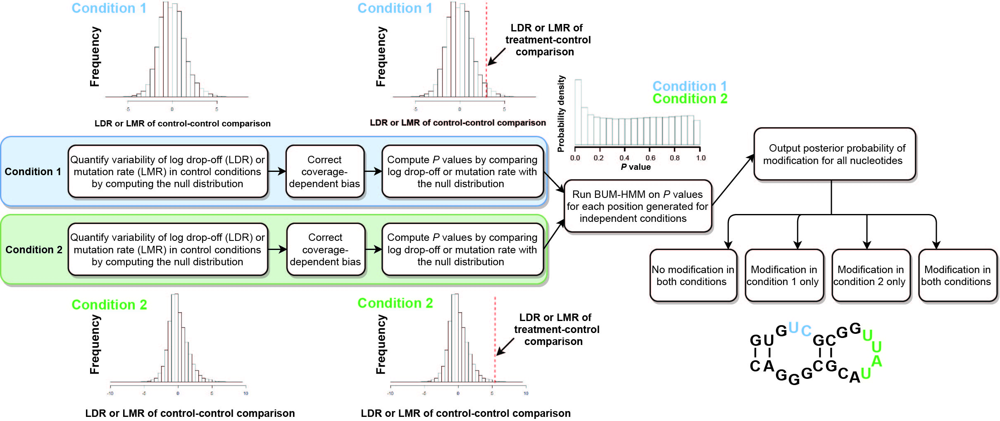

# diffBUM-HMM
Bayesian modelling approach for detecting RNA flexibility changes in high-throughput structure probing data

The code implementing diffBUM-HMM is based on the [original BUM-HMM Bioconductor package](https://bioconductor.org/packages/release/bioc/html/BUMHMM.html) hosted in [this repository](https://github.com/alinaselega/BUMHMM).

## Background 
RNA structure is known to be a key regulator of many important mechanisms, such as RNA stability, transcription, and mRNA translation. RNA structural regulatory elements are interrogated with chemical and enzymatic structure probing. In these experiments, a chemical adduct reacts with the RNA molecule in a structure-dependent way, cleaving or otherwise modifying its flexible parts. These modified positions can then be detected, providing valuable structural information that can be used for structure prediction.
Specifically, chemical adducts halt the reverse transcriptase (RT) reaction, causing it to drop off at the modified positions and truncating the cDNA transcript (RT-stop methods). By changing the conditions for the reaction, one can alternatively force RT to misincorporate non-complementary nucleotides or introduce deletions into the cDNA transcript instead (RT-mutate methods). These drop-off or mutated positions can then be mapped back to the reference sequence. Regardless of the approach, one challenge lies in the stochasticity of this process as the RT can also drop off or introduce mutations randomly. To address this, a complementary control experiment, where no probing reagent is used, is routinely performed to monitor random RT drop-offs or mutations.

Beta-uniform mixture hidden Markov model (BUM-HMM) is a statistical framework for modelling reactivity scores from an RNA structure probing experiment such as SHAPE or ChemModSeq ([Selega2017](https://pubmed.ncbi.nlm.nih.gov/27819660/)).  In short, BUM-HMM outputs posterior probabilities of modification for all nucleotides under a single condition, by comparing treated samples against control ones. 

Once we have concluded whether a certain nucleotide is modified in a given condition X, where X can be a chemical reagent, temperature, or of a certain genotype, how can we compare that to the degree of modification of the same nucleotide under a different condition Y?

Differential BUM-HMM (diffBUM-HMM) is a natural extension of BUM-HMM, where the number of hidden states is increased from 2 to 4, to allow modelling probabilities of modification between two conditions (see figure below). DiffBUM-HMM requires the coverage and drop-off/mutation counts for the differentially probed RNA of interest, to compute drop-off/mutation rates. For each experimental condition (e.g. Condition 1 and 2), the log-ratios for drop-off/mutation rates (LDRs/LMRs) at each nucleotide position are computed for pairs of control samples to give a null distribution, in order to quantify variability in drop-off or mutation rates observed by chance. LDRs/LMRs are also computed similarly for all possible treatment-control comparisons. Coverage-dependent biases are then removed by applying a variance stabilization transformation. 

Subsequently, per-nucleotide empirical P values are computed for all possible treatment-control comparisons in each condition, by comparing the corresponding log-ratios to the null distribution. DiffBUM-HMM is run on P values associated with the two independent conditions as observations, leaving out any nucleotides with missing data. The resulting output is a posterior probability of modification for each nucleotide, ranging from 0 to 1. DiffBUM-HMM reports whether nucleotides were unmodified in both conditions, modified in either of the conditions or modified in both conditions.

In our paper (currently a preprint available from BioRxiv: [Marangio2020](https://www.biorxiv.org/content/10.1101/2020.07.30.229179v1)), we demonstrate that, compared to the existing approaches including dStruct and deltaSHAPE, diffBUM-HMM displays higher sensitivity while calling virtually no false positives. DiffBUM-HMM analysis of ex vivo and in vivo Xist lncRNA SHAPE-MaP data detected many more RNA structural differences, involving mostly single-stranded nucleotides located at or near protein-binding sites. Collectively, our analyses demonstrate the value of diffBUM-HMM for quantitatively detecting RNA structural changes and reinforce the notion that RNA structure probing is a very powerful tool for identifying protein-binding sites.



## Reproducing figures from the paper

| Figure | Instructions for raw data analysis | Jupyter Notebook for figure generation |
|   ------------- |-------------        | -------------|
| 2-3  | [Instructions](./Jupyter_notebooks/Figure_2_3/instructions_data_analysis_fig2_3.txt)  | [Notebook](./Jupyter_notebooks/Figure_2_3/Plotting_5'ETS_and_35S_data.ipynb)  |
| 4   |  [Instructions](./Jupyter_notebooks/Figure_4/instructions_data_analysis_fig4.txt)  | [Notebook](./Jupyter_notebooks/Figure_4/AnalysisOfControlData.ipynb)   |
| 5A-B   | [Instructions](./Jupyter_notebooks/Figure_5/instructions_data_analysis_fig5.txt)    | [Notebook](./Jupyter_notebooks/Figure_5/Binning_and_smoothing_diffBUM_HMM_signal/notebook_binned_results.ipynb)   |
| 5C   | [Instructions](./Jupyter_notebooks/Figure_5/instructions_data_analysis_fig5.txt)     | [Notebook](./Jupyter_notebooks/Figure_5/Heatmap_diffBUM-HMM_&_deltaSHAPE_with_protein_binding_sites/heatmap.ipynb)    |
| 5D   | [Instructions](./Jupyter_notebooks/Figure_5/instructions_data_analysis_fig5.txt)     | [Notebook](./Jupyter_notebooks/Figure_5/Hypergeometric_test_Xist_bindingsites/notebook_hypergeometric_test.ipynb)  |
| 6   | [Instructions](./Jupyter_notebooks/Figure_6/instructions_data_analysis_fig6.txt)   | [Notebook](./Jupyter_notebooks/Figure_6/Nucleotide_analyses.ipynb)     |
| S1    | [Instructions](./Jupyter_notebooks/Supplementary_Figure_1/instructions_data_analysis_figS1.txt)   |[Notebook](./Jupyter_notebooks/Supplementary_Figure_1/Plotting_pertubation_tests.ipynb)    |
| S2    | N/A   |[Notebook](./Jupyter_notebooks/Supplementary_Figure_2/Motif_analyses.ipynb)    |
| S3    | [Instructions](./Jupyter_notebooks/Supplementary_Figure_3/instructions_SF3.txt)   | N/A    |
| S4    | [Instructions](./Jupyter_notebooks/Supplementary_Figure_4/instructions_SF4.txt)    | N/A    |
| S5    | [Instructions](./Jupyter_notebooks/Supplementary_Figure_5/instructions_SF5.txt)  | N/A   |
| S6    | to be added  |[Notebook](./Jupyter_notebooks/Supplementary_Figure_6/Plotting_5'ETS_and_35S_data-Region 405-502 with DOR.ipynb)|

The table above only includes instructions for figures (or subpanels of figures) from the paper that have been generated programmatically. 

## Dependencies

The pipeline is built in R. Python and Jupyter (notebook) are needed for performing some of the raw data analysis and figure generation. 

- R 4.0.0 (2020-04-24) (version 3.6.3 2020-02-29 tested working)
- RStudio 1.2.5001 (version 1.1.442 tested working)
- Python 3.7.6 (unless specified otherwise)

If .R scripts are run using previous versions of R, Bioconductor v 3.10 needs to be installed.

## Requirements 

The `renv` package was used for recording version of the packages used in the R environment. We also provide a requirements.txt file listing Python packages with versions used in the development and benchmarking of the diffBUM-HMM pipeline described in this study, as reference and also to enable quick installation of the packages.

```R
#Restores the state of the R development environment from renv.lock 
renv::restore()
```

```bash
#Restores the state of the Python development environment from python-requirements.txt 
pip install -r python_requirements.txt
```

## A note on OS compatibility

The entire repository has been tested successfully on Mac OS. All .R scripts have been tested successfully for Mac OS and Windows. Jupyter notebooks for Figure 4, 6 and S2 have partial dependencies (the pyCRAC software package and MEME Suite software) that are only supported by Mac OS and Linux, hence cannot be fully run on Windows.


