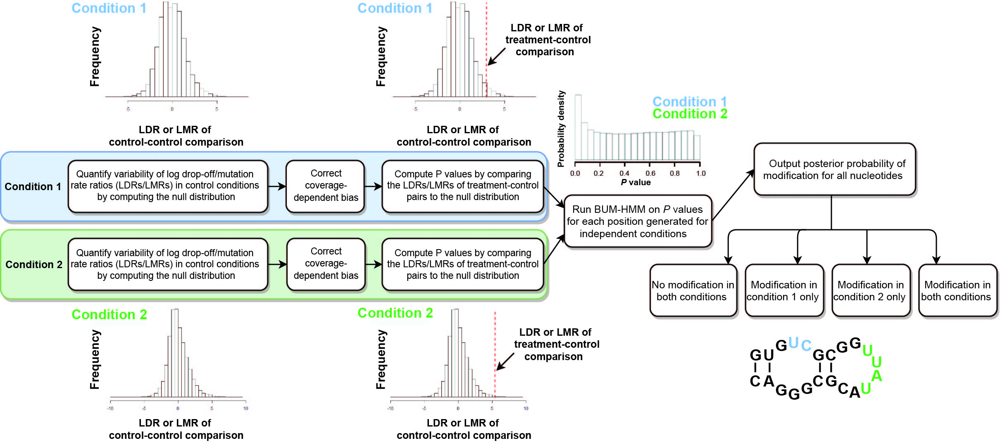

# diffBUM_HMM
Bayesian modelling approach for detecting RNA flexibility changes in high-throughput structure probing data

## Background 
RNA structure is known to be a key regulator of many important mechanisms, such as RNA stability, transcription, and mRNA translation. RNA structural regulatory elements are interrogated with chemical and enzymatic structure probing. In these experiments, a chemical agent reacts with the RNA molecule in a structure-dependent way, cleaving or otherwise modifying its flexible parts. These modified positions can then be detected, providing valuable structural information that can be used for structure prediction.
Specifically, chemical modification terminates the reverse transcription reaction, resulting in the reverse transcriptase (RT) dropping off at the modified positions. These positions of drop-off can be then mapped back to the reference sequence. However, the challenge lies in the stochasticity of this process as the RT can also drop off randomly. To address this, a complementary control experiment is routinely performed to monitor random RT drop-offs when no reagent is used.

Beta-uniform mixture hidden Markov model (BUM-HMM) is a statistical framework for modelling reactivity scores from an RNA structure probing experiment such as SHAPE or ChemModSeq ([Selega2017](https://pubmed.ncbi.nlm.nih.gov/27819660/)).  In short, the BUM-HMM outputs posterior probabilities of modification for all nucleotides in a single condition, by comparing treated samples against control ones. 

But once we have reached the conclusion about whether a certain nucleotide is modified in given condition X, where X can be intended as chemical reagent or temperature, how can we compare that output to the degree of modification of the same nucleotide with treatment Y, where Y is another chemical reagent or temperature?

DiffBUM-HMM (differential BUM-HMM) is a natural extension of BUM-HMM, where the number of hidden states is increased from 2 to 4, allowing to model probabilities of modification between two conditions (see figure below). For each experimental condition (e.g. Condition 1 and 2), the null distribution of log (with base e) drop-off rates or log mutation rates (SHAPE-MaP) at each nucleotide position is computed for control samples in order to quantify variability in drop-off or mutation rates observed by chance. Subsequently, coverage-dependent biases are removed by applying a variance stabilization transformation. The different null distributions are computed for different nucleotide patterns to address sequence-dependent bias. Subsequently, per-nucleotide empirical P values are computed for all pairs of treatment and control replicate samples in each condition, by comparing the corresponding log of drop-off rates (LDRs) or log of mutation rates (LMRs, for SHAPE-MaP) to the null distribution. DiffBUM-HMM is run on P values associated with the two independent conditions as observations, leaving out any nucleotides with missing data. The resulting output is a posterior probability of modification for each nucleotide, ranging from 0 to 1. DiffBUM-HMM reports whether nucleotides were unmodified in both conditions, modified in either of the conditions or modified in both conditions.

## Reproducing figures from the paper
| Figure | Instructions for raw data analysis | Jupyter Notebook for figure generation |
|   ------------- |-------------        | -------------|
| 2-3  | [Instructions](./Jupyter_notebooks/Figure_2_3/instructions_data_analysis_fig2_3.txt)  | [Notebook](./Jupyter_notebooks/Figure_2_3/Plotting_5'ETS_and_35S_data.ipynb)  |
| 4   |  [Instructions](./Jupyter_notebooks/Figure_4/instructions_data_analysis_fig4.txt)  | TBA     |
| 5A-B   | [Instructions](./Jupyter_notebooks/Figure_5/instructions_data_analysis_fig5.txt)    | [Notebook](./Jupyter_notebooks/Figure_5/Binning_and_smoothing_diffBUM_HMM_signal/notebook_binned_results.ipynb)   |
| 5C   | [Instructions](./Jupyter_notebooks/Figure_5/instructions_data_analysis_fig5.txt)     | [Notebook](./Jupyter_notebooks/Figure_5/Heatmap_diffBUM-HMM_&_deltaSHAPE_with_protein_binding_sites/heatmap.ipynb)    |
| 5D   | [Instructions](./Jupyter_notebooks/Figure_5/instructions_data_analysis_fig5.txt)     | [Notebook](./Jupyter_notebooks/Figure_5/Hypergeometric_test_Xist_bindingsites/notebook_hypergeometric_test.ipynb)  |
| 6   | [Instructions](./Jupyter_notebooks/Figure_6/instructions_data_analysis_fig6.txt)   | [Notebook](./Jupyter_notebooks/Figure_6/Nucleotide_analyses.ipynb)     |
| S1    | [Instructions](./Jupyter_notebooks/Supplementary_Figure_1/instructions_data_analysis_figS1.txt)   |[Notebook](./Jupyter_notebooks/Supplementary_Figure_1/Plotting_pertubation_tests.ipynb)    |
| S3    | [Instructions](./Jupyter_notebooks/Supplementary_Figure_3/instructions_SF3.txt)   | N/A    |
| S4    | [Instructions](./Jupyter_notebooks/Supplementary_Figure_4/instructions_SF4.txt)    | N/A    |
| S5    | [Instructions](./Jupyter_notebooks/Supplementary_Figure_5/instructions_SF5.txt)  | N/A   |

The table above only includes instructions for figures from the paper that have been generated programmatically. 

## Dependencies
The pipeline is built in R. Python and Jupyter (notebook) are needed for performing some of the raw data analysis and figure generation. 

- R 4.0.0 (2020-04-24) (version 3.6.3 2020-02-29 tested working)
- RStudio 1.2.5001 (version 1.1.442 tested working)
- Python 3.7.6 (unless specified otherwise)

## Requirements 
We provide a requirements.txt file listing R and Python packages with correct versions used in the development and benchmarking of the diffBUM-HMM pipeline describe in this study, as reference and also to enable quick installation of the packages. TBA

